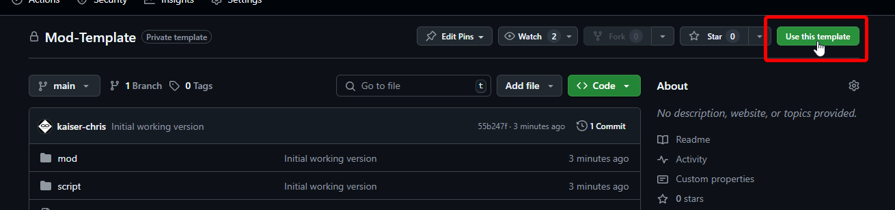

# Overview
This is a template to create a new repository for a Victoria 3 mod.

# Content
- [Setup](#setup)
  - [Creating your own Repository](#creating-your-own-repository)
  - [Checkout your new Repository](#checkout-your-new-repository)
  - [Adjusting Mod Metadata](#adjusting-mod-metadata)
  - [Open the Launcher](#open-the-launcher)
  - [Final Adjustments](#final-adjustments)
- [Folder Structure](#folder-structure)
- [Further Resources](#further-resources)

# Setup

## Creating your own Repository

To set up a new repository using this template,
click on the "Use this Template" button on GitHub:


## Checkout your new Repository

It is recommended to not check out the repository into the games mod folder.
If you are new to git and GitHub please read up on how to do this.

## Adjusting Mod Metadata

The first action you should take is to configure your new mods' metadata.
This is done by editing the [mod/.metadata/metadata.json](mod/.metadata/metadata.json) file.

The important things to change are:
- name
- id
- short_description

## Adding your Mod to the Game

To add the mod to the game/launcher we need to link it in the games mod folder.

### Windows

This can best be done via a folder junction. To create a new junction, we can use this command:
```
mklink /j "X:\path\to\Documents\Paradox Interactive\Victoria 3\mod\your-mod-folder" "X:\path\to\the\mod\directory\in\the\repo"
```
Important is that we point not to the repository but to the [mod](mod) subfolder.

The command can be run by either opening a Terminal or by pressing Win + R and putting the adjusted command into the run window.

**NOTE:** You need to replace the paths with the corresponding ones for your installation

### Linux

```
ln -s "~/path/to/mod/directory/in/the/repo" "~/.local/share/Paradox Interactive/Victoria 3/mod/your-mod-folder"
```

## Open the Launcher

In the Paradox Launcher, your mod should now show up and can be added to a playset as normal.

## Final Adjustments

It is recommended to replace the thumbnails before releasing your mod to steam.

There are two thumbnails for Victoria 3 mods:
- [Steam Workshop Thumbnail](mod/thumbnail.png)
- [Paradox Launcher Thumbnail](mod/.metadata/thumbnail.png)

# Folder Structure

This Repository is designed so you do not release your documentation or git folders to steam.

The [documentation](documentation) folder is meant for documentation
you may have for your mod like Markdown files or other types of documents.

The [image](image) folder is meant for reference images like original size images
that you used to create game images or templates for game images.
Included in this repository are:
- Template images for game logos of different types
- GIMP files to easily create Production Method and Building icons

The [mod](mod) folder contains the mod itself and is where you generally work in.

Finally, the [script](script) folder is meant for bash or batch scripts that you
developed for automating tasks for your mod.
This repository contains a script to copy your localization files from one language
to another.
That is helpful if you develop your mod in a base language like english and still want
your players to be able to use the mod in other languages.

# Further Resources

## Victoria 3 Wiki

The Victoria 3 Wiki can be outdated at times when it comes to modding,
but it is still a great resource and starting point for new modders.

https://vic3.paradoxwikis.com/Modding

## Victoria 3 Modding Coop

The Victoria 3 Modding Coop is a community maintained Discord server
that is quite active and can answer a lot of potential questions about
how to do specific things.

https://discord.com/invite/uUbuMTQjA7
